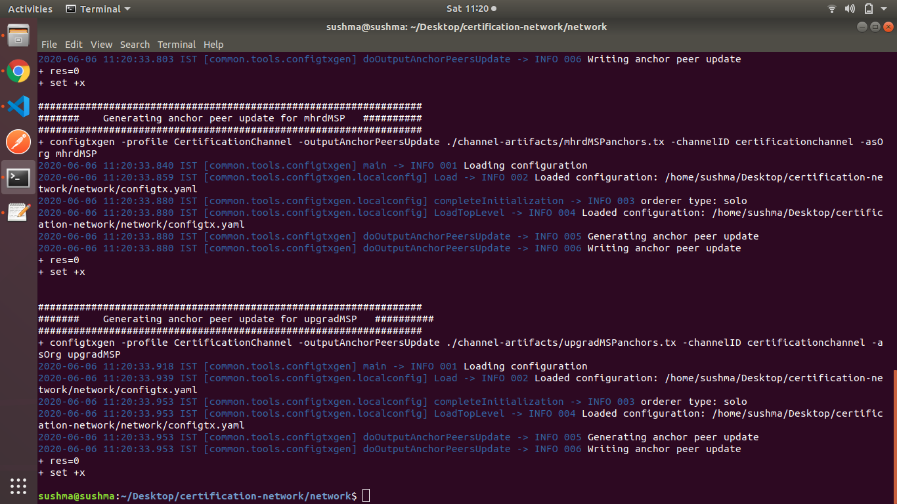
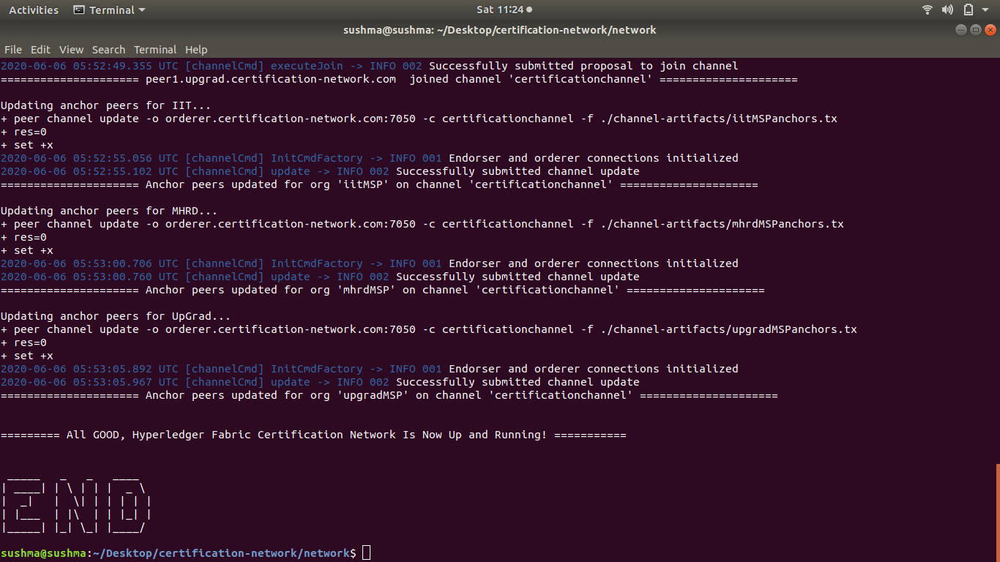
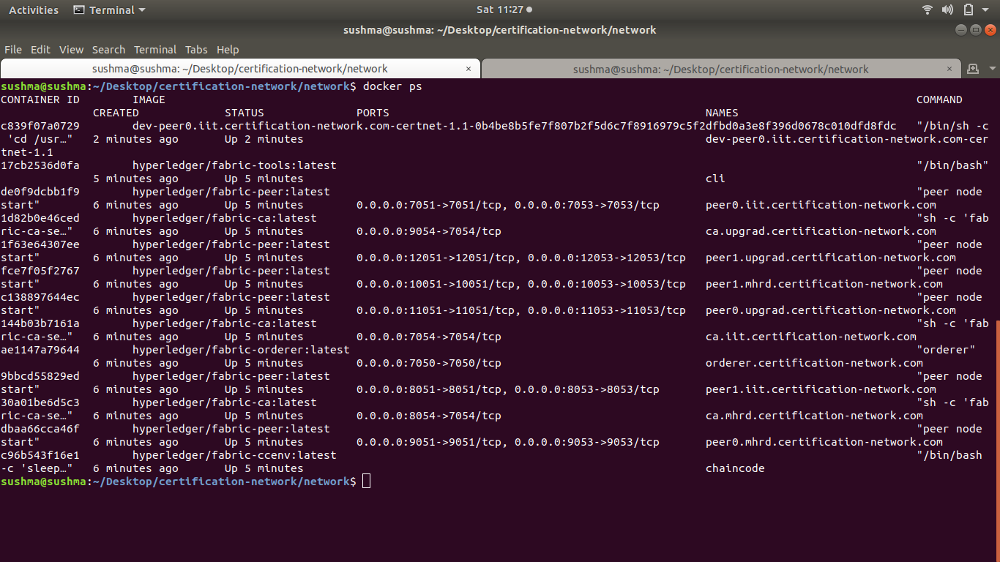
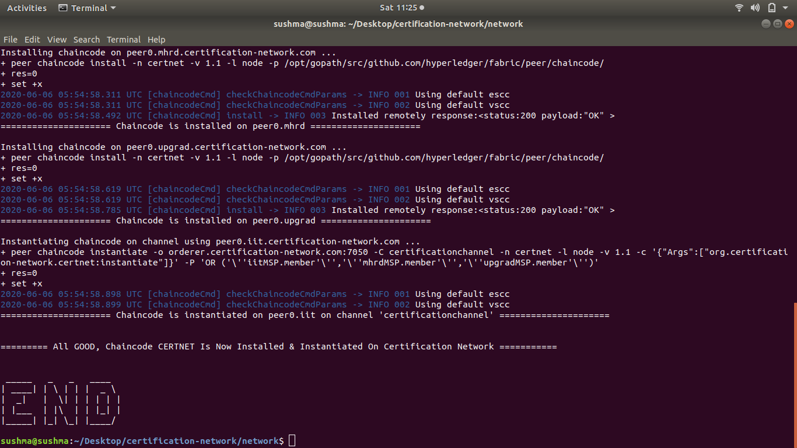
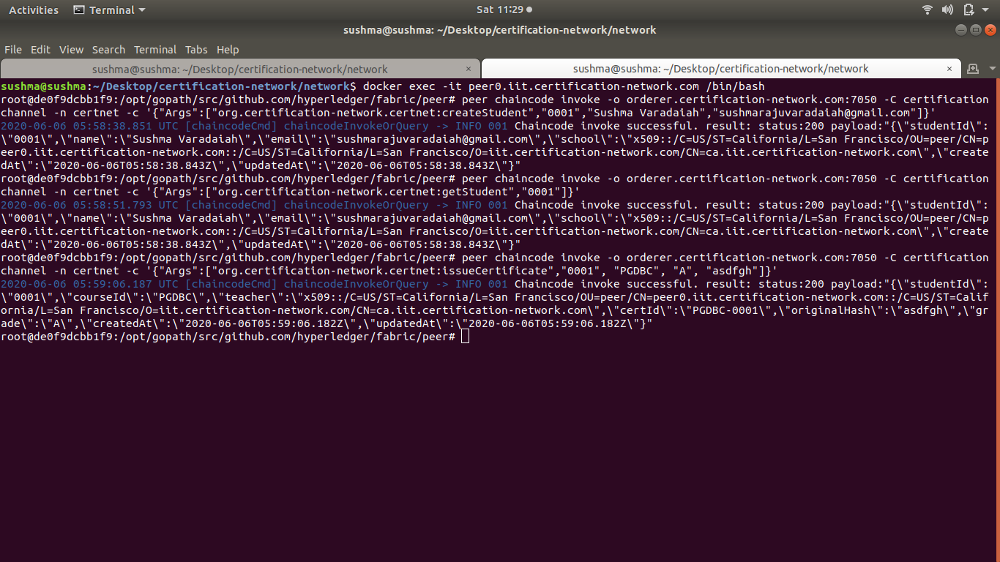
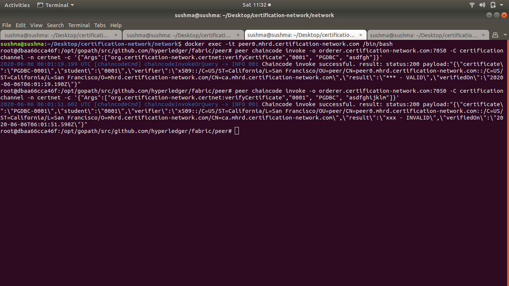
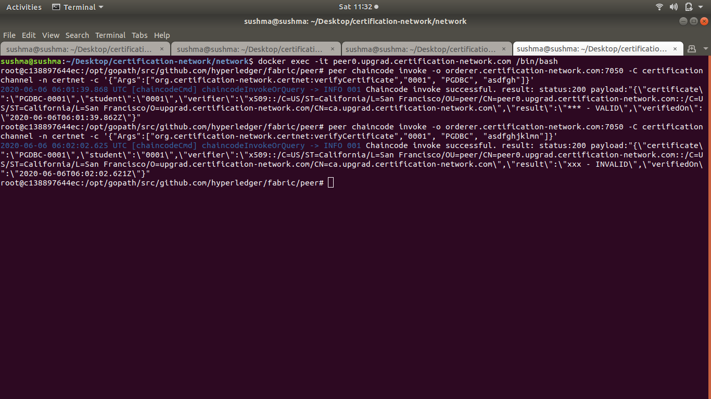

# Certification Network

## Hyperledger Fabric Network for Verifying the Authenticity of a Certifcate.

The main purpose of this network is to easily identify the authenticity of the certificates provided by student/employee to an organisation. As an organisation trying to onboard a student/employee has to go through all the certifcates provided by the student/employee and it's a time consuming process of back and forth email and phone calls. With the help of this solution anyone can verify the authenticity of the cerficate within no time.

Below are the list of peers forming the network.

**IIT** - IIT as an organisation issuing the certificates contributes 2 peers.

**MHRD** - Ministry of Human Resource and Development organisation which can keep track of the certificates issued by all the organisation and also verify the authenticity of the certificates issued to each student will contribute 2 peers for the network.

**upGrad** - Organisation who wants to verify the authenticity of the certificate contributes 2 peers.

The fabric network for the above peers will be set up using **Docker** and the chaincode that simulates the certification issue, verification process is written in Node.js.

**Folder structure of the project**

1. `chaincode` folder contains the details about the chaincode.

2. `network` folder contains the details about the fabric network setup.

Below snapshots shows the fabric network set up and execution of the smart contracts on the fabric network.

- Generate crypto material for each entity in the network.
  

- Bring network up by creating docker containers for each of the network participants.
  

  

- Install chaincode on top the running network.
  

- Execute chaincode on top of the network. Create student from one of peers from IIT and issue certificate for that student.
  

- Verify the certificate of that student from MHRD peer.
  

- Verify the certifcate of that student from UpGrad peer.
  

This summaries the fabric network setup for certification network. Smart contract execution on fabric network for creating a student, retrieving the student details from fabric network, issue a certificate to the student and verification of the certificate.
